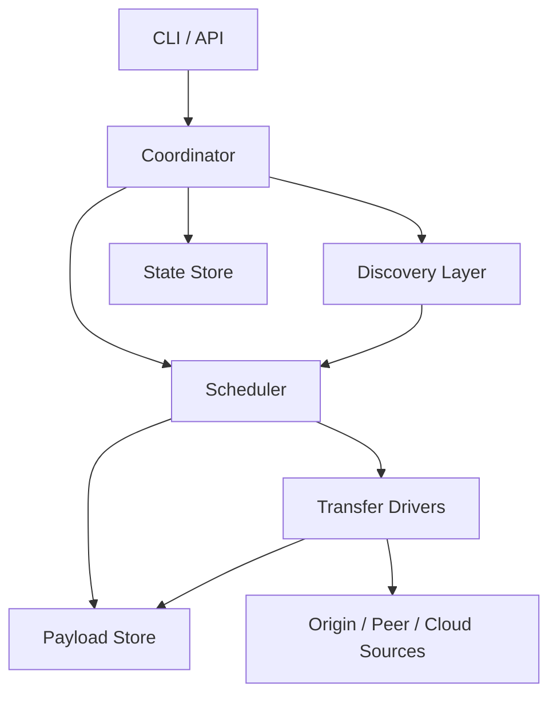

# paradown 多协议演进架构分析

更新时间：2026-04-15

仓库路径：`/Users/liulipeng/workspace/rust/paradown`

## 1. 结论先说

如果目标只是把当前框架扩展到：

- `HTTP/HTTPS`
- `FTP`
- 其他“单源、单文件、可顺序拉流或可 Range 的协议”

那现有架构可以继续演进，不需要推翻重来，但需要把当前 HTTP 假设抽象出去。

如果目标是扩展到你上面分析的“迅雷式能力”，也就是：

- `BT`
- `Magnet`
- `DHT / Tracker / Peer Wire`
- 多源混合下载
- P2SP
- 云端离线下载
- 热点缓存 / 边缘复用

那答案是：**可以做，但必须升级架构，不是简单加几个协议分支就够了。**

更准确地说，当前 `paradown` 的主干已经具备一个不错的“下载任务生命周期框架”，但它的核心数据模型仍然是：

- 一个任务对应一个 `url`
- 一个任务对应一个文件路径
- 一个 worker 对应一个 `start..end` 字节区间
- 一个准备阶段先做 HTTP probe，再分块，再启动 reqwest worker

这套模型非常适合现在的 HTTP 分段下载器，但不够表达：

- 多文件种子
- piece/block 校验
- peer 发现
- 多来源竞争与协同
- 云端离线任务
- 源质量打分和多源带宽调度

所以结论不是“当前架构不行”，而是：

- **现有架构适合作为控制平面的基础**
- **现有数据平面和领域模型不够通用，需要升级**

## 2. 当前架构的真实定位

基于当前代码，它更准确的定位是：

- 一个面向 `HTTP Range` 的分段下载器
- 带有任务管理、恢复、持久化、限速、校验的生命周期框架

当前主干模块大致是：

- `src/coordinator/`：任务协调、排队、事件收敛、恢复装配
- `src/job/`：单任务准备、状态流转、worker 协调、完成收敛
- `src/worker/`：单 worker 传输、重试、运行时
- `src/storage/`：任务状态持久化与模型映射
- `src/repository/`：sqlite / memory 状态仓储
- `src/scheduler/`：piece-aware 的 worker 规划
- `src/protocol_probe.rs`：HTTP 资源探测

对照当前公开 API，可以看到它的中心模型还是：

- `download::Manager`
- `download::Task`
- `download::Worker`
- `download::TaskRequest`

而 `TaskRequest` 当前只有这些核心字段：

- `url`
- `file_name`
- `file_path`
- `checksums`
- `downloaded_size`
- `total_size`

这说明它当前表达的是“一个 URL 指向的一个文件任务”，而不是“一个资源会话”。

## 3. 当前架构哪些地方可以复用

如果要演进到更强的下载内核，下面这些是可以继续保留的：

### 3.1 协调器壳层可以复用

`src/coordinator/mod.rs` 里的 `Manager` 已经承担了：

- 任务注册
- 并发控制
- 排队
- 全局事件订阅
- 启停恢复

这类“控制平面”职责本来就不会因为协议增加而消失，所以它适合继续保留，只是内部不该再直接依赖 HTTP 风格的任务对象。

### 3.2 状态机思路可以复用

当前 `job/state.rs` 和 `worker/mod.rs` 已经有：

- `Pending`
- `Preparing`
- `Running`
- `Paused`
- `Completed`
- `Canceled`
- `Failed`

这类生命周期仍然有价值。以后协议再复杂，任务级状态机依然存在。

### 3.3 状态持久化框架可以复用

`src/storage/mod.rs` 和 `src/repository/` 这一层现在做的是“状态落盘”，这件事未来仍然必须存在。

能继续复用的不是当前表结构本身，而是这类边界：

- 状态仓储 trait
- sqlite / memory backend
- 恢复入口
- runtime <-> DB 的映射层

### 3.4 错误、配置、事件思路可以复用

这些基础设施层面的抽象现在已经成型：

- `Config`
- `Error`
- `Event`
- `Status`
- retry / rate limit / throttle

将来即使协议更多，这些横切能力依然需要存在。

## 4. 当前架构哪些地方会成为硬限制

如果要上 BT / Magnet / P2SP / 离线下载，下面这些就是当前架构的硬边界。

### 4.1 `Task` 仍然是“单 URL 单文件任务”

当前 `src/job/mod.rs` 里的 `Task` 直接持有：

- `url`
- `file_name`
- `file_path`
- `total_size`
- `downloaded_size`

这天然假设：

- 一个任务只有一个入口 URL
- 一个任务最终只对应一个文件路径
- 总长度是单个连续字节空间

但 BT / Magnet 的真实模型是：

- 一个任务可能是一组文件
- 一个任务的下载入口不是单 URL，而是 `infohash + metadata + peer set`
- 一个任务的完整性不是整体文件 checksum，而是 `piece hash`

所以 `Task` 需要从“文件下载任务”升级成“资源下载会话”。

### 4.2 `Worker` 当前是 HTTP Range worker

当前 `src/worker/mod.rs` 里的 `Worker` 直接持有：

- `reqwest::Client`
- `url`
- `start`
- `end`
- `file_path`

这意味着它本质上不是“通用传输执行器”，而是：

- 一个对某个 URL 发请求
- 下载某个字节区间
- 直接写进本地文件

这对 HTTP/HTTPS 很合理，但对：

- FTP 数据流
- BT piece 请求
- peer block request
- 云端缓存回传

都不够通用。

### 4.3 `protocol_probe` 是 HTTP 专用准备阶段

当前 `src/protocol_probe.rs` 做的是：

- `HEAD`
- `Range: bytes=0-0`
- `Content-Length`
- `Content-Range`

这本质上是 HTTP origin probe，而不是“协议无关的资源发现层”。

以后如果支持 BT / Magnet，准备阶段会变成：

- magnet 解析
- metadata 获取
- tracker 发现
- DHT 发现
- swarm 建立
- piece layout 获取

这显然已经不是 probe 一个 URL 的问题了。

### 4.4 当前调度器仍主要服务连续字节空间

当前运行时虽然已经切到 `src/scheduler/planner.rs`，但它的核心输出仍然是：

- 总长度 `total_size`
- 切成多个 `[start, end]`

这适合：

- 单文件
- 连续字节空间
- 固定范围分块

但对 BT 来说真正的调度单位更接近：

- `piece`
- `block`
- 文件和 piece 的映射关系

如果后续 scheduler 仍长期只输出这种连续区间 assignment，就会把整个系统继续绑死在“Range 下载器”模型上。

### 4.5 `Store` 当前保存的是任务状态，不是下载内容状态

现在 `src/storage/mod.rs` 主要保存：

- task
- worker
- checksum

这对 HTTP 单文件恢复已经够用。

但对 BT / Magnet / P2SP 来说，还需要持久化：

- manifest / metadata
- piece 完成位图
- block 完成状态
- source 评分
- peer 状态
- swarm 元信息
- tracker / DHT 节点状态
- 文件集映射

换句话说，未来必须区分：

- `StateStore`：任务状态和恢复元信息
- `PayloadStore`：真实数据块、文件映射、piece 完成度

当前 `Store` 只覆盖了前者的一部分。

## 5. 如果只兼容“更多单源协议”，需要改到什么程度

这里要先区分两类扩展目标。

### 5.1 目标 A：兼容 HTTP / HTTPS / FTP / WebDAV / S3 这类单源协议

这一类协议虽然细节不同，但总体上仍然属于：

- 有一个 origin
- 可以拉完整内容
- 某些协议支持 range / partial
- 完整性仍可落到文件级或分段级

如果目标只到这里，当前架构不需要大换血，主要做下面几件事：

1. 把 `TaskRequest.url` 升级成 `ResourceLocator`
2. 把 `protocol_probe` 抽象成 `SourceProbe`
3. 把 `Worker` 从 HTTP worker 改成 `OriginTransferWorker`
4. 把 `reqwest::Client` 从 `Worker` 结构中剥离到协议驱动内部
5. 把 `chunk.rs` 保留为“单源连续字节空间分块器”

也就是说，这个阶段还是可以沿着现有主干演进的。

### 5.2 目标 B：兼容 BT / Magnet / P2SP / 离线下载

如果目标到这里，单靠“给 Worker 加 if/else 分协议”会迅速失控。

因为这时你面对的已经不是多几个协议，而是多几类完全不同的下载范式：

- `Origin pull`：从服务器拉
- `Swarm pull`：从 peer 集群拉
- `Hybrid pull`：同一个 piece 可来自 origin / CDN / peer
- `Cloud pull`：云端已经下载好，本地只需要回传

这不是“多协议客户端”，而是“多来源下载平台”。

## 6. 面向迅雷式能力，核心模型应该怎么变

如果要往“迅雷感”演进，建议把领域模型从“任务/worker/区间”升级成下面这组核心概念。

### 6.1 `DownloadSpec`：用户提交的下载描述

它替代当前的 `TaskRequest` 作为统一入口。

建议形态：

```rust
pub enum DownloadSpec {
    Http { url: String },
    Ftp { url: String },
    TorrentFile { path: PathBuf },
    Magnet { uri: String },
    OfflineAsset { asset_id: String },
}
```

它的职责是“用户给了什么”，而不是“系统内部最终如何下载”。

### 6.2 `SessionManifest`：系统内部的统一资源描述

不管来源是什么，进入调度层之前都统一变成一个 manifest。

建议包含：

- 内容 ID
- 文件列表
- 总大小
- piece 大小
- piece 数量
- piece 校验信息
- 文件与 piece 的映射关系
- 可用 source 列表

这一层非常关键，因为它决定了：

- HTTP 单文件任务也能被统一表达
- BT 多文件任务也能被统一表达
- 云端缓存命中的文件也能被统一表达

### 6.3 `Source`：数据来源的统一抽象

建议统一建模为：

- `OriginSource`
- `PeerSource`
- `CacheSource`
- `CloudSource`

每个 source 不一定等同于协议；它表达的是“可提供数据块的来源实体”。

协议驱动则是 source 的底层实现细节。

### 6.4 `Piece` / `Block`：统一调度单位

未来调度层的最小单位不应该是 `[start, end]`，而应该是：

- `piece`：完整性校验单位
- `block`：实际并发传输单位

HTTP 仍然可以映射成 piece/block：

- piece 对应某个连续字节片段
- block 对应 piece 内的小区块

这样一来：

- HTTP
- FTP
- BT peer
- cloud cache

都能统一参与同一套调度。

### 6.5 `PayloadStore`：真实内容写入抽象

不要再让 worker 直接面对最终文件路径。

应该引入一个统一的数据落地层，负责：

- 预分配
- 稀疏写入
- piece/block 写入
- piece 完成位图
- 文件映射
- 校验后提交

这样 BT 的多文件映射、HTTP 的单文件写入、边下边播时的前部区域优先，才有共同基础。

## 7. 建议的目标架构

我建议把未来架构拆成五个大层。



### 7.1 入口层

职责：

- 接收用户输入
- 创建 `DownloadSpec`
- 管理任务列表
- 暴露查询 / 控制接口

这一层可以复用当前 `Manager` 的外壳思路。

### 7.2 发现层 `discovery`

职责：

- HTTP / FTP 资源探测
- torrent 元数据解析
- magnet -> metadata 解析
- tracker / DHT 节点发现
- 云端离线任务状态查询

建议拆成：

- `discovery::origin`
- `discovery::torrent`
- `discovery::magnet`
- `discovery::cloud`

这层的输出不应该是 task 直接开跑，而应该是 `SessionManifest`。

### 7.3 调度层 `scheduler`

这是未来最值钱的一层。

职责：

- piece 选择
- block 分配
- 多源竞争
- 源质量评分
- 限速 / 限并发
- 稀缺块 / 热点块策略
- 预览优先 / 选中文件优先

这一层以后决定“像不像迅雷”。

### 7.4 传输层 `transfer`

职责：

- 根据 source 类型执行真实传输
- origin range 请求
- FTP data connection
- BT peer block request
- cloud 回传

建议用 driver 设计：

- `transfer::origin_http`
- `transfer::origin_ftp`
- `transfer::peer_bt`
- `transfer::cloud_fetch`

当前 `worker/` 可以演进为这层，但不能继续让“一个 Worker == 一个 HTTP 区间请求”成为核心定义。

### 7.5 存储层

建议明确拆成两块：

- `state_store`
  - 会话状态
  - source 状态
  - piece 位图
  - 恢复元数据

- `payload_store`
  - 真实字节写入
  - 文件映射
  - piece 校验
  - 预分配 / 稀疏文件 / cache

当前 `storage/` 更接近 `state_store` 的雏形，不是完整存储层。

## 8. 当前项目具体应该怎么调整

这里给一个尽量贴近现状的改造建议。

## 8.1 第一阶段：把“HTTP 下载器”升级成“单源协议平台”

目标：

- 保持当前功能稳定
- 不引入 BT
- 先把 HTTP 假设抽离

应该做：

1. `TaskRequest` 升级为 `DownloadSpec`
2. `Task` 升级为 `Session`
3. `Worker` 升级为 `TransferWorker`
4. `protocol_probe.rs` 改成 `discovery/origin.rs`
5. 引入 `scheduler/planner.rs`，并明确当前只服务 `origin-range`
6. `Store` 改名并收窄为 `StateStore`

这个阶段完成后，框架就不再把“下载 = HTTP Range”写死在核心模型里。

## 8.2 第二阶段：引入统一 manifest 和 piece 模型

目标：

- 为 BT / Magnet 做地基
- 统一单文件和多文件模型

应该做：

1. 引入 `SessionManifest`
2. 引入 `PieceLayout`
3. 引入 `FileManifest`
4. 引入 `PayloadStore`
5. 把 `Task.total_size/downloaded_size` 改成从 manifest / piece bitmap 聚合计算

这是最关键的一步，因为之后所有协议都会靠它对齐。

## 8.3 第三阶段：引入 BT / Magnet 发现层

目标：

- 让非 URL 型资源也能进入统一调度平面

应该做：

1. 新增 torrent 元数据解析
2. 新增 magnet -> metadata 获取流程
3. 新增 tracker / DHT 发现模块
4. 将发现结果转换成统一 `SessionManifest`

到这一步，系统才真正跨过“单 URL 下载器”的边界。

## 8.4 第四阶段：引入 source 调度器

目标：

- 一个 piece 可来自多个 source
- 为 P2SP 做基础

应该做：

1. 建立 `SourceScore`
2. 建立 `SourceHealth`
3. 建立 `PiecePicker`
4. 建立 `BandwidthAllocator`
5. 建立 `Penalty / Retry / Cooldown` 机制

当前 `rate_limiter`、retry、queue 逻辑可以保留思路，但要下沉到 scheduler。

## 8.5 第五阶段：引入云端离线与缓存源

目标：

- 让云端缓存 / 离线任务成为新的 source 类型

应该做：

1. `CloudSource`
2. `OfflineTaskProvider`
3. 云端任务状态同步
4. 本地回传下载

注意这一步已经不是单机内核问题，而是客户端 + 服务端系统问题。

## 9. 推荐的新目录形态

如果朝这个方向演进，我建议未来代码结构逐步变成：

```text
src/
  api/
    download.rs
  coordinator/
  discovery/
    origin.rs
    torrent.rs
    magnet.rs
    cloud.rs
  domain/
    spec.rs
    manifest.rs
    piece.rs
    source.rs
    session.rs
  scheduler/
    piece_picker.rs
    source_scoring.rs
    bandwidth.rs
    planner.rs
  transfer/
    http.rs
    ftp.rs
    peer.rs
    cloud.rs
  payload/
    store.rs
    verifier.rs
    file_map.rs
  state/
    store.rs
    mapping.rs
    repository/
  cli/
```

不一定一步到位，但目标应该是这个方向：**协议、调度、存储、发现各自独立。**

## 10. 当前哪些类型建议未来废弃

下面这些不是“现在必须删”，而是如果走多协议路线，应该逐步退场。

### 10.1 `Task.url`

原因：

- torrent / magnet / offline task 都不能被单 URL 表达

建议替换成：

- `spec: DownloadSpec`
- `manifest_id`

### 10.2 `Worker.start/end`

原因：

- 这把 worker 定义死成了 HTTP range downloader

建议替换成：

- `assigned_block`
- `piece_id`
- `source_id`

### 10.3 `protocol_probe_completed`

原因：

- 它表达的是“HTTP 探测完成”，不是“资源发现完成”

建议替换成：

- `discovery_state`

### 10.4 连续区间调度器作为统一分块入口

原因：

- 它只适合连续字节空间

建议未来收缩为：

- `origin_range_planner`

## 11. 你这套框架如果要接近“迅雷感”，最难的点在哪

这个问题比“支不支持 BT”更重要。

### 11.1 最难的是统一调度，不是统一协议

协议只是 source 接入方式。

真正复杂的是：

- 同一个 piece 该从谁下载
- 一个慢源要不要降权
- 一个不稳定的 peer 还能不能继续用
- 云端缓存命中了要不要直接切走 origin

这就是调度器问题。

### 11.2 第二难的是统一内容模型

如果没有统一的 manifest / piece / payload store：

- HTTP 是文件
- BT 是种子
- magnet 是 infohash
- cloud 是离线任务

系统内部就永远没法说同一种语言。

### 11.3 第三难的是恢复一致性

BT/P2SP 的恢复远比 HTTP 复杂：

- piece 是否完整
- 校验是否通过
- source 信任是否过期
- swarm 状态是否还有效
- 云端任务是否还存在

当前恢复层已经有不错雏形，但以后必须从“恢复一个任务状态”升级成“恢复一个下载会话图”。

## 12. 我对可行性的判断

结论是：

- **技术上完全可能**
- **工程上要分阶段做**
- **不能在当前 `Task + Worker + Range` 模型上硬堆功能**

如果演进方式正确，这个项目是有潜力走到下面这条路径的：

1. 稳定的 HTTP/HTTPS 下载器
2. 单源多协议下载平台
3. 带 manifest / piece 模型的统一下载引擎
4. BT / Magnet 内核
5. 多源调度器
6. P2SP / 云端离线扩展

但如果演进方式不对，比如：

- 继续让 `Task.url` 成为一切中心
- 继续让 `Worker.start/end` 成为统一执行模型
- 继续让 `protocol_probe` 代表整个准备阶段

那系统会越来越像“为了兼容而加分支”，最后很难收住。

## 13. 最后给一个直接判断

如果你的目标是“把现在这个项目做成高级 HTTP 下载器”，当前架构已经够用了，继续精修就可以。

如果你的目标是“把它做成支持 HTTP/FTP/BT/Magnet/P2SP/离线下载的统一引擎”，那我建议：

- 保留当前控制平面
- 重做资源模型
- 重做调度核心
- 把传输层驱动化
- 把状态存储和内容存储拆开

一句话总结：

**这个项目可以向迅雷式能力演进，但前提是从“URL/文件/区间”模型，升级到“资源会话/source/piece/manifest”模型。**
